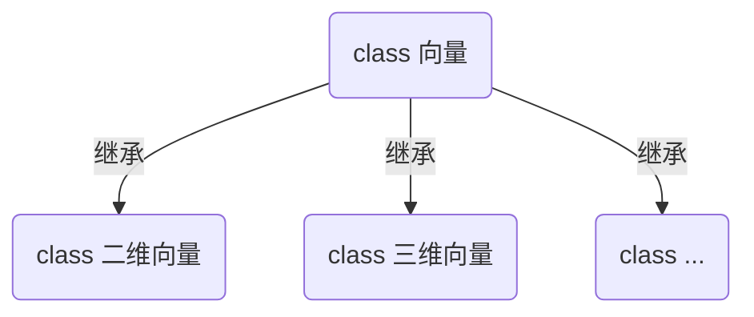

[TOC]

# Math for Programmers (R Edition)

R edition for the book "Math for Programmers: 3D Graphics, Machine Learning and Silumations with Python".

（泛化）向量的数据结构用 data.table，任意维度向量的运算都用同一个函数完成

不必要，向量的数据结构应该就用R的原生向量

可视化用 R plotly

