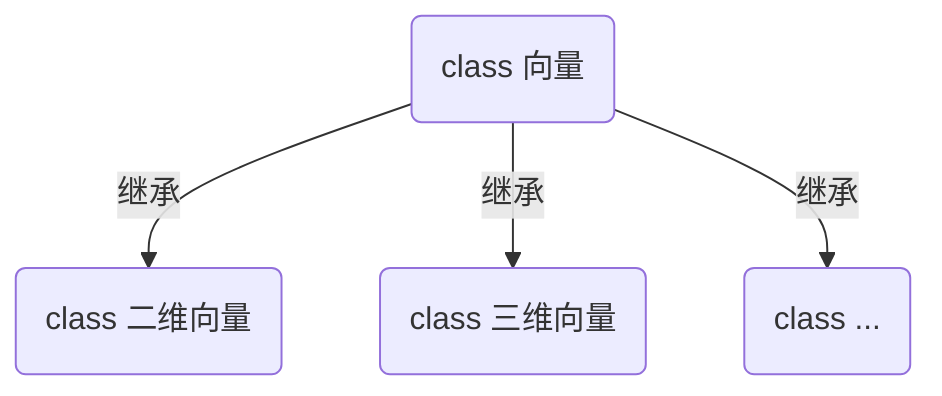

[TOC]

# Math for Programmers (R Edition)

This project is the R edition of the book *__Math for Programmers: 3D Graphics, Machine Learning and Silumations with Python__*.


向量/空间中点的数据结构应该就用 R 的原生（列）向量，任意维度向量的运算都用封装为同一个函数。

多个点组成的一个集合，用什么数据结构？用矩阵！每一列都是一个点。

计算阶段用向量、矩阵而非数据框，可以简化逻辑。画图时，为了向 plotly 传递参数，才在绘图函数中将向量、矩阵封装为数据框。

```R
# 二维平面中四个点
point1 <- c(1, 2)
point2 <- c(3, 4)
point3 <- c(5, 4)
point4 <- c(7, 2)

# 它们的集合，组织为一个矩阵，代表该多边形（是个梯形）
polygon <- c(v1, v2, v3, v4) %>% matrix(nrow = 2)
```

可视化用 R plotly


面向对象的思路，暂时不需要



